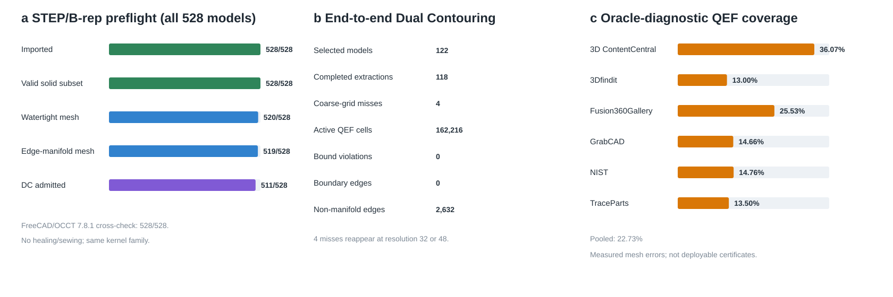

# Real-CAD preflight and Dual Contouring experiment (2026-08-10)

## Outcome

The fixed corpus contains 528 STEP files: 28 manually curated public/industrial
models and a deterministic 500-model Fusion 360 Gallery sample. OpenCascade
7.9.3 imported all 528 files. The imported full shape and every extracted solid
subset passed `BRepCheck_Analyzer`; every solid subset had closed shells and
strictly positive B-rep volume.

The same 528 files were then processed in isolated FreeCAD 1.1.1 subprocesses,
whose Part module is backed by OpenCascade 7.8.1. All files imported, and all
validity, solid/shell/face-count, closure, auxiliary-shell, and positive-volume
classifications agreed. Every volume pair was within a relative tolerance of
1e-4; the maximum relative difference was
5.9858336e-05 on
C04. This is a
cross-version and cross-frontend consistency check within the OpenCascade
family, not an independent second-kernel validation.

The no-healing tessellation gate admitted 511/528 models. Eight derived meshes
had boundary edges and nine had non-manifold edges. These 17 rows remain in the
denominator. No crash, timeout, missing file, hash mismatch, or invalid JSON was
observed.

The manual corpus is now backed by a complete 50-to-28 candidate ledger. It
enumerates all 33 STEP members in the frozen NIST archive and all 17 external
download receipts. Twenty-two NIST alternatives were excluded by explicit,
reproducible rules (11 AP203 geometry-only duplicates, five AP203 PMI
duplicates, and six AP242 alternatives outside the preregistered core/replacement
rule); all 17 external candidates were retained. The NIST archive and every
selected STEP file are independently rehashed against their receipt or sample
manifest before any result record is trusted.

| Preflight gate | Passed |
|---|---:|
| STEP import | 528/528 |
| Full imported shape valid | 528/528 |
| Solid subset valid | 528/528 |
| All solid shells closed | 528/528 |
| All B-rep solid volumes positive | 528/528 |
| Derived mesh watertight | 520/528 |
| Derived mesh edge-manifold | 519/528 |
| Derived mesh signed volume positive | 528/528 |
| Dual Contouring admitted | 511/528 |

The 17 no-healing rejections decompose by source as follows. The six manual
rejections and eleven Fusion rejections are retained as explicit rows rather
than being silently removed.

| Source group | Total | Admitted | Boundary rejection | Non-manifold rejection | Rejected |
|---|---:|---:|---:|---:|---:|
| 3D ContentCentral | 4 | 4 | 0 | 0 | 0 |
| 3Dfindit | 4 | 1 | 0 | 3 | 3 |
| Fusion360Gallery | 500 | 489 | 8 | 3 | 11 |
| GrabCAD | 5 | 4 | 0 | 1 | 1 |
| NIST | 11 | 11 | 0 | 0 | 0 |
| TraceParts | 4 | 2 | 0 | 2 | 2 |

## End-to-end protocol

All 22 admitted manually curated models and the first 100 admitted Fusion rows
in frozen sample order were selected. Manual models used resolution 32 and
Fusion models resolution 24 across the longest bounding-box axis. Each model
ran in isolated OpenCascade-export and Dual-Contouring subprocesses. The
pipeline sampled a fast-winding signed distance, created Hermite constraints on
sign-changing edges, solved a cell-centred regularized QEF with lambda=0.1, and
connected cell vertices with the standard uniform-grid Dual Contouring rule.

| Source group | Selected | Completed | Active cells | Pooled oracle-diagnostic coverage |
|---|---:|---:|---:|---:|
| 3D ContentCentral | 4 | 4 | 11,522 | 36.07% |
| 3Dfindit | 1 | 1 | 7,037 | 13.00% |
| Fusion360Gallery | 100 | 96 | 99,516 | 25.53% |
| GrabCAD | 4 | 4 | 15,125 | 14.66% |
| NIST | 11 | 11 | 20,387 | 14.76% |
| TraceParts | 2 | 2 | 8,629 | 13.50% |

The main run completed 118/122 models. Four thin/anisotropic Fusion parts had no
grid-node sign change at resolution 24. A diagnostic-only ladder recovered
F054 and F085 at resolution 32, and F034 and F083 at resolution 48. The four
main-run failures were not replaced by the rescue results.

Across 162,216 active cells, 36,866 met the tau=0.10 oracle-diagnostic QEF
bound (pooled coverage 22.73%);
the model-wise median coverage was 13.76%.
There were zero violations of the complete QEF displacement bound. The median,
over models, of the median normal-angle error was
3.72 degrees;
the 95th percentile across model-level 95th-percentile normal errors was
74.29 degrees.

The baseline DC meshes had zero boundary edges and zero degenerate triangles,
but 2,632 non-manifold edges across
79/118 completed models. This is a material limitation of the
standard sign-pattern connectivity and motivates a manifold/adaptive DC stage.
The median model mean surface error was
0.0462 cell
units, while the 95th percentile of per-model maximum error was
0.7987 cell
units.

## Interpretation boundary

The original triangle mesh supplies closest points and pseudo-normals for the
QEF audit. Consequently the reported bound coverage is an **oracle diagnostic**
of the theorem-to-implementation chain, not a deployable certificate. The real
CAD files do not provide certified value/gradient budgets. A cell-centre
fallback was generated for `Unknown` cells and is explicitly uncertified; its
median mean error (0.2842 cell units) is worse than the baseline,
so the contract should be presented as a status/guard mechanism, not an
automatic geometry improvement.

FreeCAD initially aborted only inside the Codex sandbox because that environment
masked ARM NEON capability detection. The same native arm64 installation ran
normally outside the sandbox and completed the 528-model cross-check. Because
FreeCAD Part is itself backed by OpenCascade, this corroborates the primary
OpenCascade 7.9.3 results across versions and frontends but does not supply an
independent CAD kernel. Assimp routed AP214 STEP to its IFC importer and is
excluded from B-rep claims. The derived-mesh topology audit is likewise not
described as CAD-kernel validation.



## Reproduction

```sh
export GRADIENT_QEF_CAD_ROOT=/path/to/CAD_Tests_Models
cmake -S occt_preflight -B occt_preflight/build -DCMAKE_BUILD_TYPE=Release
cmake --build occt_preflight/build -j4
cmake -S dual_contouring -B dual_contouring/build -DCMAKE_BUILD_TYPE=Release
cmake --build dual_contouring/build -j4
python3 run_occt_preflight.py --workers 4 --timeout 120
python3 run_freecad_preflight.py --workers 4 --timeout 120 --output results/freecad_preflight_v3
python3 compare_brep_preflights.py
python3 run_dual_contouring.py --workers 4 --timeout 180 --fusion-count 100
python3 run_resolution_rescue.py
python3 build_manual_candidate_ledger.py
python3 summarize_real_cad_results.py
python3 verify_real_cad_results.py
python3 test_verifier_tamper_detection.py
```
